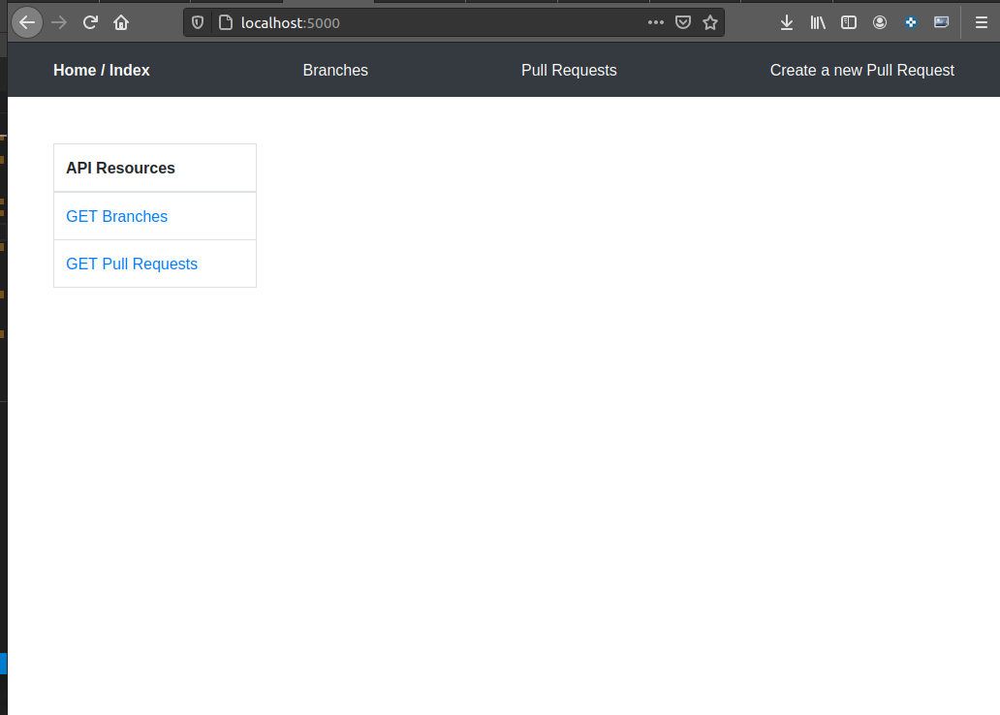
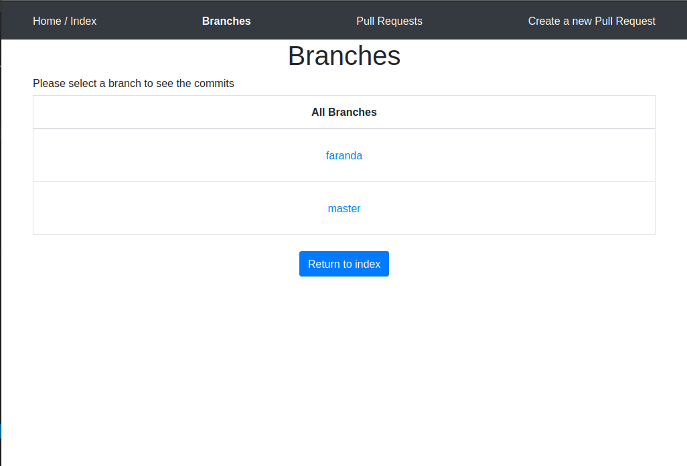
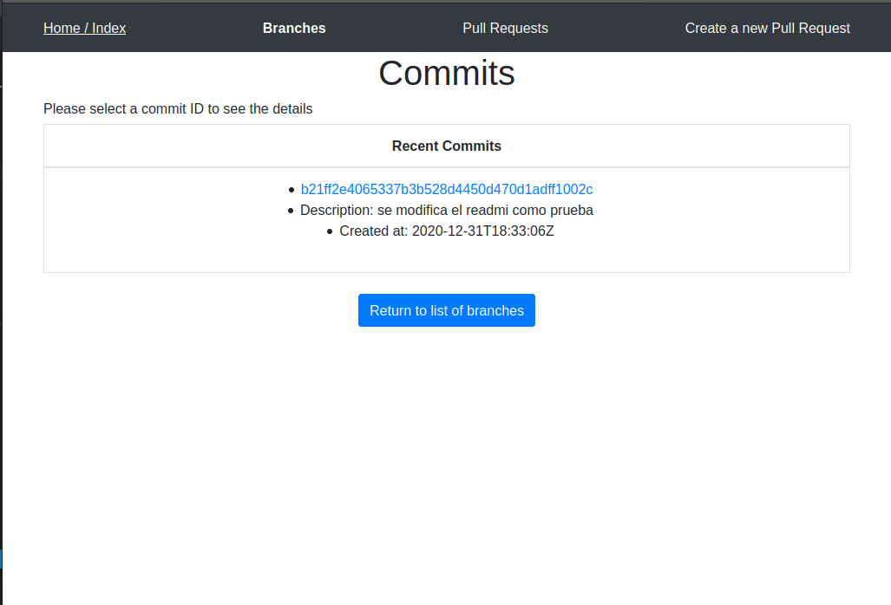
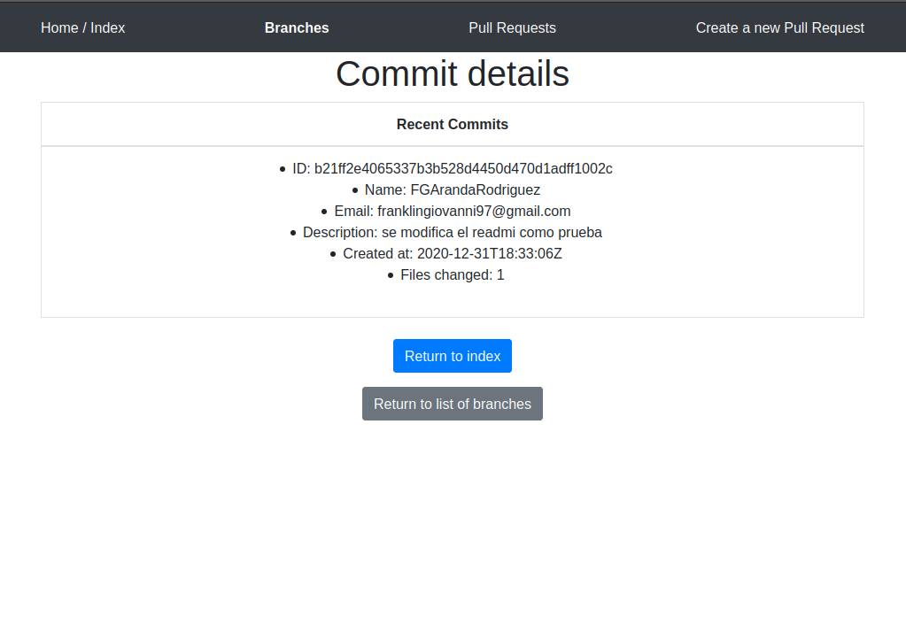
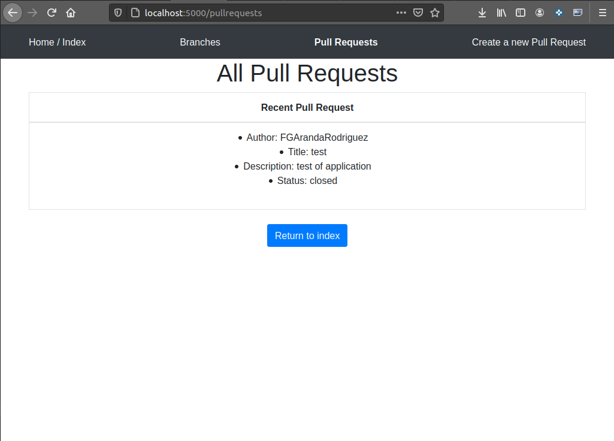
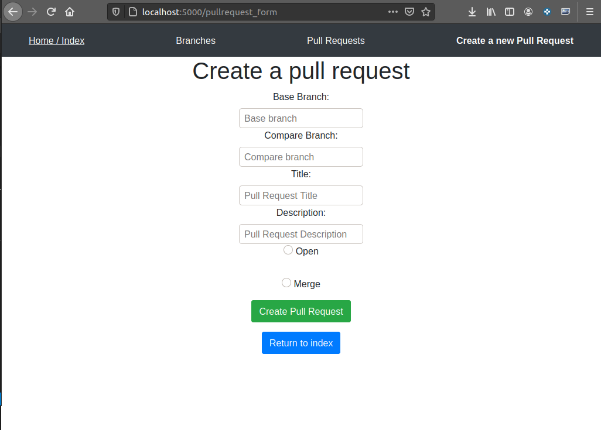

## Requirements

### 1.-To run the project you need to enter the following command:
```
    pip3 install -r requirements.txt
```
### 2. Install PostgreSQL
*You need to have PostgreSQL installed*
If you do not have it installed you can follow the steps described in the link:
[How to install PostgreSQL](https://www.digitalocean.com/community/tutorials/como-instalar-y-utilizar-postgresql-en-ubuntu-18-04-es)

### Please Run this code to continue
You need create the credentials for this  project.

Please Run the command: python3 create_creds.py with the 5 positional args you will need to substitute: 

- postgres_user is your username in Postgres
- postgres_password is your password in Postgres
- db_name is how you want to name the db
- github_user is your username in GitHub
- github_password is your password in GitHub
- github_token is your personal token of github, (If you don't have a personal access token, you must create it. You can rely on the following link [How to create Github personal access token](https://docs.github.com/es/free-pro-team@latest/github/authenticating-to-github/creating-a-personal-access-token))

For example: 

```

python3 create_creds.py postgres_user postgres_password db_name github_user github_password

```
This will generate a config.json file

### Please create the DB Schema:

To do that run in terminal the file make_db_schema.py

```

python3 make_db_schema.py

```
### 3. Run the project

if you already have the database, run the command python main.py.

Example:

```
python3 main.py

```
## NOTE:
The repository 99minutos-fullstack-interview-test  must exist in the user account that inserts its credentials to run the code.

## IMAGES OF APPLICATION

 

 

 

 

 

 


# 99minutos Fullstack Engineer Interview
Interview test for fullstack Software Engineers

## Welcome!
If you’re reading this, it means we’re interested in working with you in 99minutos.com and solving amazing and difficult problems in shipping for online shopping tech in Latam.

This README provides the instructions to a small, self-contained test for a FullStack Software Engineer position.

## What we're looking for
We're looking for a talented and driven full-stack engineer, comfortable with building responsive front end experiences, as well as with designing and building rigorous APIs and backend services. 

This means that this test is designed to gather signal on your coding structure, the tradeoffs and decisions you make on API design, and how you build a lightweight frontend app to show the data coming from your API. We're excited to see what you build!

## The test
Today, we'll be building an API wrapper around the git information of this project. We suggest forking this repo and start working on it on your private fork, the url of which is the only thing you need to send us when you're done.

The main objects we'll be dealing with are:
- Commits
- Authors
- Branches
- PRs

We'd like to see a visual representation of the git history of this repo as a web-app, using the API previously described. To be specific, we'd like to see the following:
- A view where we can see the existing branches
- A branch detail view where we can see all the commits to one specific branch, with commit messages, authors and timestamps.
- A commit detail view where we can see the commit message, timestamp, number of files changed and author names / emails.
- A "PR" create view, where we can choose two branches (base and compare), and merge them together, just like Pull Requests work in Github. 
- A "PR" list view, where we see all created PRs and the following info: Author, Title, Description and Status (`Open`, `Closed`, `Merged`). If the status is `Open`, there should be a button that allows us to mark it as `Closed`.

For the **PR create view**, we'll ask the user for a PR title and description, and we'll give them 2 options: either save it (Status = `Open`), or merge it. Note that merge operations can fail due to conflicts or other reasons, so make sure you handle and show whatever error happens when merging. There's no need to do something about these errors other than show them in the frontend. After a successful merge, the PR should move to a `Merged` status.

## Deliverables
We expect this test to take around 4 hours, but not significantly more (your time is very valuable!). We're giving you a week from the date you receive it to complete it and send us your repo URL, using **whatever stack you feel most comfortable with**. Due to this, we ask that you also provide a `README` with instructions for running your project, both back and frontend, along with setup instructions (or provide a Dockerfile and a `docker run` instruction).

It's up to you to design how this should look code-wise, but we don't expect you to model all git objects in a DB. We're ok with reading them using a library wrapper for git like [GitPython](https://gitpython.readthedocs.io/en/stable/), on-demand. The only DB design required is the one for PRs.

## Grading
We'll grade this project according to completion percentage of the features requested, good coding style for both back and frontend. For us, good coding means:
- It's readable. We read code much more often than we write it, so it's important that we're clear on what we're doing and comment any hairy parts (which we don't really expect to have in this test!).
- It's reasonably well ordered and with a logically thought-out structure. We like to do separation of concerns, and deal with routing, DB models, serialization, etc in their own file structure / files. 
- Clear, understandable variable names. No one wants to read the whole file to understand what the variable `c1_2` means.

We also care about being able to run your test without significant effort on our part, so make sure you test the instructions you provide on your README.

### Things we won't be grading
- Design chops: we care that you know enough CSS not to be surprised when you need to work on it, but we're not picky about your solution's UX/UI.

### Bonus points
- Your code has tests.

If you come across any questions or anything we didn't cover on this README, feel free to reach out to us and we'll get you an answer as soon as possible.
If you have any question please contact jonathan@99minutos.dev or carlos.ramirez@99minutos.dev
Happy coding!
